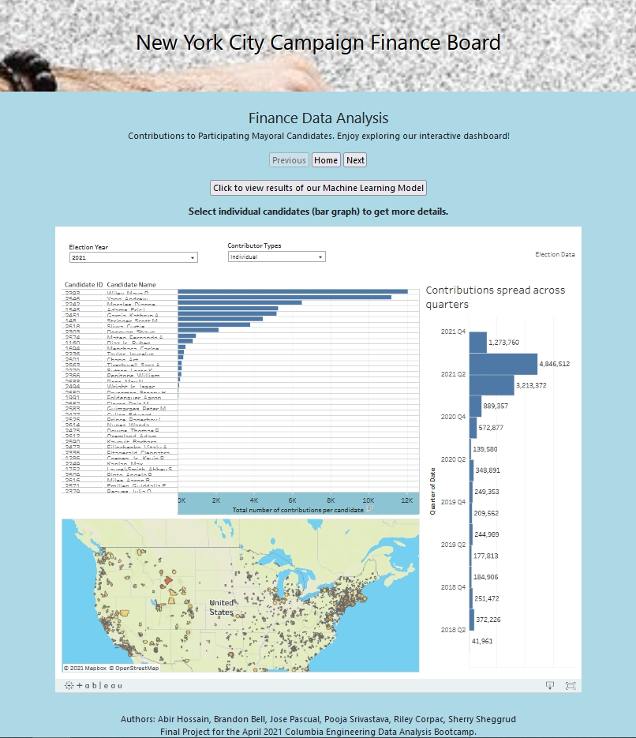

# ELECTION FINANCE DATA ANALYSIS

## Overview
- Our project will analyze New York City mayoral elections.

- We will determine whether there exists a relationship between the quantity of campaign finance donations and electoral results, and whether a donation sum from a particular occupation or industry is likewise related.

## Questions
- How much financial data play a role in Mayor candidate election outcome. 

## Technologies

AMAZON RDS, AMAZON S3, JAVASCRIPT TABLEAU API, HTML, PANDAS, PG SQL, PLOTLY, PYTHON3, TABLEAU, TENSORFLOW, PYSPARK, GOOGLE COLAB,

## Features to be Implemented

 - A Pyspark data parser on Google Colab to edit data into database entry format.

 - An Amazon Relational Database Service to host a PostgreSQL instance which will serve as a data repository, and a start and end point for the machine learning model.

 - Supervised categorical machine learning approach using TensorFlow which predicts election outcomes on categorical column attributes.

 - Dashboard composition with Tableau and Plotly composed with distribution of data, outliers, trends, hypotheses, predictions and conclusions.

## Dashboard
Tools used:
1. Tableau Public
2. Tableau Javascipt API

**Description:**
We have built our visualizations using Tableau.  Also, we have built our website using the Tableau JavaScript API, and have hosted it on Github.

Here is the link to our Dashboard. It is hosted on our github account:
https://ssheggrud.github.io/Mod_20_Project/index.html

Refer to the below link to access our tableau dashboard. This dashboard is hosted within our website created using TableauJavascriptAPI:

https://public.tableau.com/app/profile/pooja.srivastava3629/viz/ElectionsFinanceData/Dashboard1

**Who is our Target Audience?**

Anyone who is interested in learning about the role finance has on New York City’s mayoral elections.  They can see the difference between contributions and expenditures between candidates, as well as their significance.

**What are our vizualizations going to tell us?**

We have tried to visually understand how some of the data variables differ for a given candidate, such as ZIP codes, quarters (of a year), number and total amount of contributions, and total amount of expenditures per election year.
We have contributions and expenditures received and spent for each participating candidate.  The range we have chosen is between 2001 and 2021 (the general election for the latter has yet to take place,) inclusive.

**How do we add interactive elements to our dashboard?**

- We have added filters to our dashboard, making them available via the All Using Related Data Sources option, so that any selection through the filter applies to all worksheets that are in any way related to the data source.
- Please note that we have used multiple data sources and have used the Edit Blend Relationships option to link primary and secondary data sources.
- We have added Highlight Actions to our dashboard which work when a user hovers over the source sheets.
- We have added interactive text to our dashboard which dynamically change the text based on which election year was selected.

**Features**

- We have a container in which each of the dashboards appear after clicking either the Previous or Next buttons.
- Upon entering the homepage, one is taken to the first dashboard, so the Previous button is disabled.
- The Next button takes the user from the first dashboard to the next, and is then disabled once the user reaches the last dashboard.  The user can always click on the Home button to return to the homepage.
- There is a graph that shows how many contributions came in for each of the candidates.  Here, the candidate name can be selected to see data changes in the map and quarterly contribution graphs.
- The map is color-coded to better identify which zip codes had higher contributions.
- Our visualization shows the top candidates sorted by the amount received and spent.  Highlight Hover action has been created on this page to enhance visual effects.

## Data
 The data we obtained for this project include publicly available records for each NYC mayoral election campaign donation reports from Individuals and Committee/Organizations. The following records also included the Expenditure spending per election year that were tracked by each candidate. We were able to gather the data reports for the six most recent election terms, namely for 2001, 2005, 2009, 2013, 2017, and 2021.
 
 The following data that was obtained from the New York City Campaign Finance Board contained three separate .csv files for each election year: Individual, Committee and Expenditure reports. 
 
 The Individual Donation reports contained data that was tracked based on an individual’s donation contribution to a particular candidate. Each row highlights the donation amount, the donor's State, City, and Zip Code and the date each transaction was made. The following transactions contained an estimated amount of 65,000 records of tracked donations per election year.
 
 The Committee Donation reports were similar to the Individual Donation reports. The main difference was that the donations were tracked based on larger Corporation, Labor Union, Organizations, LLC, Political Action Committees, and Party Committees donations to the candidate. The following tracked Committee Donations per election year contained an average amount of 300-500 donation records per election.
 
 The Expenditure report tracked each participating candidate's per election year expenditure spending during their campaigning. Some highlighted records that were tracked are Television and Radio advertisements, Professional Services, Campaign Worker Salaries, Polling Costs, and many others. The following expenditure transactions were tracked by the location of the transaction that included the amount, date of transaction, City, State, and Zip Codes. The Expenditure reports contained an average amount of 12,000 tracked transactions per election year.
 
**Data Resources:**

https://www.nyccfb.info/follow-the-money/data-library/

Please see the following screen shot that shows the home page of where we have obatined all of our data.

### ETL Process

The steps taken to extract, transform, and load the data for analysis are as follows:

•	From the New York City Campaign Finance Board webpage download the previous six election years from 2001,2003,2005,2009,2013,2017, and 2021 data sets that contain individual donation data and committee donation data per election year as local CSVs.

•	Also extract the previous six election years for each candidate’s expenditures as separate data sets from the New York City Campaign Finance Board.

•	Study each of the 18 Excel data sets and determine which columns hold value for our final outcome. (All Raw CSVs can be found within **Resources** > **Raw CSVs** Folder)

•	Create a RDS and S3 within Amazon Web Services to store the following data sets and share publicly with team.

•	Upload each election year CSV for individual donations, committee donations, and candidate expenditures within Google Colab.(The following files can be found within **Resources > Contribution tables (CSVs) and Expenditure Reports (CSVs)**)

•	Perform Pyspark functions of reading CSVs in data frames, dropping columns, changing data types, changing column names, converting the value names within each column, filter the data frames to display only the mayor elections and participants within the mayor election year, create a total sum column that’s added by the donation amount, candidate match amount, and previous donation amount (The following scripts can be found within **DataCleaningAndTransforming > Google Colab Documents**)

•	Once the data frame is reviewed and approved by the team export the clean data frame into a new CSV (Transformed dataframes into new CSVs can be found in **Resources** )

•	Export and bridge the clean data frame tables for each election year to connect with the RDS server and Postgres SQL.

•	Create the join on committees and individual tables to prepare for machine learning.

• Merge/Union the tables by the individual data frame, committe contribution data frame, as well as the expenditure report dataframes all as a single CSV per year. (The following merged tables can be found here **Resources > Merged Contribution and Expenditure (CSVs)**) 

•	Determining columns necessary for ML

•Connect PGAdmin with Pandas to read in 2021,2017,2013,2009,2005, and 2001 merged files to being Machine Learning.

**Pre ETL of the raw campaign data**

**Post ETL of the cleaned campaign data**

**ERD OUTLINE**

**ERD CURRENT TABLES**

------------************************************************---------------------------------------------------------

## Week 1 Achievements

- We have the datasets which we will be using for our project. Refer to https://www.nyccfb.info/follow-the-money/cunymap-2021 in order to look at the individual and committee level contributions to our Mayor Candidates.
- Refer to **2017_Mayor_IC.csv** and **2017_Mayor_CC.csv** files in our repository for sample data.
- At first we had decided to get data from Legistar API provided by NYC Coucil website. We were successfully able to read data from the API. Refer to LegistarAPI.ipynb file posted on https://github.com/ssheggrud/Mod_20_Project/tree/05_Pooja . Altough we later decided that had we used that data, it would have unnecessarily added complexity to our code. Hence, we decided to add each years election results manually to a manually sourced excel as as individual column. We will name this column "Won/Elected".
- We have successfully imported the election year results of 2017 indivdual and committee contributions to a DataFrame. Please refer to: https://github.com/ssheggrud/Mod_20_Project/tree/05_Riley
- We have successfully identified roles for all the team members and have a good outline for our project.

## Week 2 Achievements

 - We have finished the presentation slide show: https://docs.google.com/presentation/d/1Y1IFccSH7uFPhK94G6A1tpfghD0K2uWRChJvdhHHcMU/edit?usp=sharing
 - We have come up with few dashboards and a storyboard in Tableau.
 - We have started work on linking our tableau vizualization to our html page using Tableau Javascript API.
 - Successful transformed the 2017 Election year Individual, Committee, and Expenditures raw CSV's into a transformed and test ready file from Google Colab using Pyspark and Pandas while exporting the cleaned dataframes into SQL and new local CSVs. To see the final 2017 transformation process please refer to the **DataCleaningTransformation** folder.
 - Static table, join script and other DB scripts were added to the DBScripts folder.
 - A base sklearn's K-nearest neighbor model can been created and run on a sample 2017 data. 

## ML Model
### Overview
The purpose of our model is to create a supervised learning algorithm to predict the total amount of money raised in a particular zip code for every New York City Mayoral election between 2005 and 2021. For our model, we used a Random Forest Regressor. The code for our data can be found within the MLScripts folder of our repository. The models are named Regressions_2005, Regressions_2009, Regressions_2013, Regressions_2017, and Regressions_2021, with the numbers at the end corresponding with the election year.
### Preprocessing
#### Feature Engineering
The CSV files were initially sourced from the NYC Campaign Finance Board's website which were first cleaned using SQL and PgAdmin and were then loaded onto a notebook. The raw CSV files contained columns with the the amount, matched amount, and previous contributions, and we then aggregated those three columns to create a new column with the total amount of contributions given to a particular candidate. We then used Pandas' groupby function to groupby the sum of total amount of contribution based on the zip code from where the donation originated.

#### Feature Selection
To determine which features we deemed were necessary to test our model, we created various graphs of our raw data to determine whether we could visually identify a relationship between the total amount of money raised and a particular zip code. Using a the Pandas groupby function and matplotlib, we created bar charts which indicated a relationship between the total amount raised and particular zip codes. Initially, the goal of our project was to create a supervised classification model which could determine the outcome of past elections using these same features but we determined such a model would not be feasible in the allotted time, therefore we shifted to the current regression model. However, during our feature selection process we determined that the same features would be applicable to both models. Two columns of the initial CSV were removed prior to being fed into the model as we determined that they added no value to the model. These were the year of election column and the previous amount column. The former was removed because it was a superfluous column that added no value while the latter was removed because the data from that column was already factored in the amount column. The final features selected for our models are as follows:
- Zip code
- Type of contribution (individual, corporation, PAC, et al.)
- Date of contribution
- City of contribution
- State of contribution
- Amount of contribution
- Amount of contribution matched by the city
- The amount of money spent by the candidate's campaign (expenditures)

#### Encoding
To encode our data we used sklearn's label encoder. We encoded all non-numerical data within our dataset with sklearn's fit_transform function to ensure our model would be able to read it. We did not encode the amount, matched amount, expenditures, and total amount, as we needed them unencoded to be able to visually analyze our data and there did not seem to be any major effects to our model without such encoding.

### Model Choice
We used a Random Forest Regressor for our model. We chose this model for a variety of reasons, which are as follows:
- Able to work around outliers
- The training and prediction speeds are quick
- Contains low bias and moderate variance
- It is capable of handling unbalanced data
The model is not without it's drawbacks, as it can be difficult to interpret, it can often overfit the data, and can take up a lot of memory if the dataset is large.

Initially, we were using the Random Forest Classifier for our model as we were attempting to create a classification model which can predict the outcomes of an election but we decided that a regression model to predict the total amount of money raised would be more realistic to complete in the allotted time. We therefore decided to change our model to the current one.

### Training and testing
We trained and tested our dataset using sklearn's train_test_split. The features listed above were all used as the X values and the total amount raised was used as the y value. The training size was 0.7 and testing size was 0.3 which was determined after various test models suggested this was the optimal split. The data was then fitted and tested using the Random Forest Regressor, after which the predictions were generated. 

### Accuracy Score
To test for accuracy, we applied the R-squared function to our predictions. As we tested the model on four datasets, the R-squared values are as follows:
- 2005: 0.71
- 2009: 0.92
- 2013: 0.87
- 2017: 0.92
- 2021: 0.88
These high correlation results indicates that there is a correlation between the features we selected for our model and the the total amount of money raised in a particular zip code. The rather high correlation calculated by our model can also indicate that there were bugs in our code that led to some kind of imbalance that skewed our data. Further analyses must be done before we can use these as conclusive results. We plan on also calculating Root Mean Squared Error (RMSE), Residual Standard Error (RSE), Mean Absolute Error (MAE) to further analyze the accuracy of our model.

### Week 3: 
- Tweaking the website to best display the Tableau data. HTML and CSS files were edited to better display the API from Tableau.

- We have finished the website with Tableau data: https://ssheggrud.github.io/Mod_20_Project/index.html
- (more text here)
